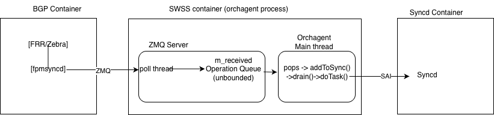
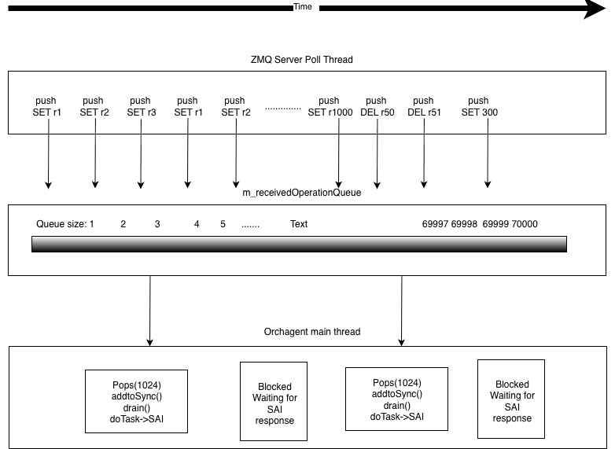
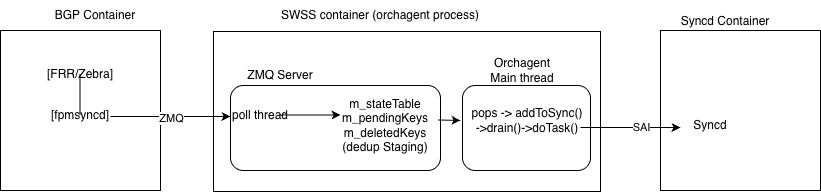

<!-- omit from toc -->
# ZMQ Queue Deduplication in ZmqConsumerStateTable #

<!-- omit from toc -->
## Table of Content

<!-- TOC -->

- [1. Revision](#1-revision)
- [2. Definitions/Abbreviations](#2-definitionsabbreviations)
- [3. Scope](#3-scope)
- [4. Overview](#4-overview)
  - [4.1. Context](#41-context)
    - [4.1.1. Current Architecture](#411-current-architecture)
    - [4.1.2. Problem](#412-problem)
    - [4.1.3. Why the Queue Grows](#413-why-the-queue-grows)
  - [4.2. Solution](#42-solution)
- [5. High-Level Design](#5-high-level-design)
  - [5.1. Phase 1: ZMQ Queue Deduplication](#51-phase-1-zmq-queue-deduplication)
    - [5.1.1. Deduplication at Ingestion](#511-deduplication-at-ingestion)
    - [5.1.2. Order Preservation](#512-order-preservation)
    - [5.1.3. Thread Safety — Double-Buffer Design](#513-thread-safety--double-buffer-design)
    - [5.1.4. AsyncDBUpdater Interaction](#514-asyncdbupdater-interaction)
    - [5.1.5. Restart and Reload Safety](#515-restart-and-reload-safety)
    - [5.1.6. Compatibility with Existing Optimizations](#516-compatibility-with-existing-optimizations)
  - [5.2. Phase 2: RingBuffer Integration for ZmqConsumer](#52-phase-2-ringbuffer-integration-for-zmqconsumer)
    - [5.2.1. Gap Analysis](#521-gap-analysis)
    - [5.2.2. Why Both Phases are Needed](#522-why-both-phases-are-needed)
    - [5.2.3. Future: Remove Batch Limit in pops() (Phase 3)](#523-future-remove-batch-limit-in-pops-phase-3)
- [6. Expected Impact](#6-expected-impact)
- [7. Testing](#7-testing)
- [8. Links to Code PRs](#8-links-to-code-prs)

<!-- /TOC -->

## 1. Revision

| Rev  |    Date    |       Author       | Change Description |
| :--: | :--------: | :----------------: | :----------------: |
| 0.1  | 2026-03-07 |    Reji Thomas     | Initial version    |
| 0.2  | 2026-03-20 |    Reji Thomas     | Double-buffer design for thread safety |

## 2. Definitions/Abbreviations

| Definitions/Abbreviation | Description                                          |
| ------------------------ | ---------------------------------------------------- |
| APP_DB                   | SONiC Application Database (Redis)                   |
| BGP                      | Border Gateway Protocol                              |
| FRR                      | Free Range Routing                                   |
| NHG                      | NextHop Group                                        |
| SAI                      | Switch Abstraction Interface                         |
| ZMQ                      | ZeroMQ (high-performance asynchronous messaging)     |

## 3. Scope

Introduce deduplication of route operations in `ZmqConsumerStateTable` to eliminate redundant SET/DEL operations for the same route key before they reach orchagent, reducing memory and processing time during BGP churn events.

## 4. Overview

### 4.1. Context

#### 4.1.1. Current Architecture

SONiC's high-performance route programming path uses ZMQ to bypass Redis. FRR's `fpmsyncd` sends route operations over a ZMQ socket to orchagent's `ZmqConsumerStateTable`, which stores them in an internal queue. The orchagent main thread pops entries from this queue in batches, processes them through `addToSync()`, and programs the ASIC via synchronous SAI API calls.


*Figure 1: Current ZMQ data path — unbounded queue with no deduplication*

In the traditional Redis-based path, deduplication happens naturally: Redis is a key-value store, so multiple SETs to the same key overwrite the previous value. The ZMQ path bypasses Redis for performance but loses this natural deduplication.

#### 4.1.2. Problem

During BGP convergence events, `fpmsyncd` sends a burst of route updates. Many of these are redundant — the same route key is updated multiple times in rapid succession (e.g., nexthop changes, route flapping). The `ZmqConsumerStateTable` queue stores every operation without deduplication, leading to unbounded queue growth.

Observed during `test_bgp_update_replication.py`:

| Timestamp | Queue Size |
| --------- | ---------- |
| 13:23:13  | 7          |
| 13:23:17  | 3,350      |
| 13:25:15  | 69,485     |

With ~10,000 unique routes, the queue accumulated ~70,000 operations — an average of 7 redundant operations per route — consuming ~68 MB of memory and ~35 seconds of processing time.

#### 4.1.3. Why the Queue Grows

The orchagent main thread processes route batches **synchronously**: each batch goes through `addToSync()` → `drain()` → `doTask()` → SAI API calls. SAI calls are blocking — the main thread waits for the ASIC to respond before returning to process the next batch. This chunked processing is intentional: it ensures other orchagent components (portsorch, aclorch, etc.) get CPU time in the shared Select loop.

While the main thread is blocked on SAI calls, the ZMQ poll thread (a separate thread) continues receiving data from `fpmsyncd` and pushing to the queue. The queue grows because the producer (ZMQ poll thread) is faster than the consumer (main thread blocked on SAI).

Deduplication exists in `addToSync()`, but it only collapses entries **within a single batch**. Duplicates across batches are not detected.


*Figure 2: Queue growth during BGP churn — ZMQ poll thread pushes faster than main thread drains*

### 4.2. Solution

Replace the unbounded FIFO queue with an in-memory key-value staging area that mimics Redis semantics: **last-writer-wins** for SET operations, explicit tracking for DEL operations, with insertion order preserved.

Multiple operations on the same route key are collapsed into a single entry representing the final state. When orchagent calls `pops()`, it receives only unique keys with their latest state — identical to what it would see from a Redis-backed `ConsumerStateTable`.


*Figure 3: Proposed data path — deduplication at ingestion, before orchagent processing*

## 5. High-Level Design

### 5.1. Phase 1: ZMQ Queue Deduplication

**Files to modify:** `sonic-swss-common/common/zmqconsumerstatetable.h`, `sonic-swss-common/common/zmqconsumerstatetable.cpp`

**No changes to:** orchagent, fpmsyncd, restart/reload protocols, AsyncDBUpdater.

#### 5.1.1. Deduplication at Ingestion

The existing unbounded queue (`m_receivedOperationQueue`) is replaced with three structures:

| Structure        | Type                          | Purpose                                  |
| ---------------- | ----------------------------- | ---------------------------------------- |
| `m_stateTable`   | `unordered_map<key, entry>`   | Stores latest SET value per key          |
| `m_pendingKeys`  | `deque<key>`                  | Preserves insertion order for processing |
| `m_deletedKeys`  | `unordered_set<key>`          | Tracks keys with pending DEL             |

When `handleReceivedData()` receives operations from the ZMQ poll thread:

- **SET**: Stores/overwrites the entry in `m_stateTable`. Removes the key from `m_deletedKeys` if present.
- **DEL**: Removes the entry from `m_stateTable`. Adds the key to `m_deletedKeys`.
- A key is appended to `m_pendingKeys` only on **first encounter** — subsequent operations for the same key update its state in-place without adding duplicate entries.

When `pops()` is called by the main thread, it iterates `m_pendingKeys` up to the batch size limit, emitting the **final state** (SET or DEL) for each key. The result is identical to what a Redis-backed consumer would return.

**Example — route flapping (5 operations → 1):**

```
Incoming:   SET r1 → DEL r1 → SET r1 → DEL r1 → SET r1
Queue:      m_stateTable = {r1: SET},  m_pendingKeys = [r1]
pops():     returns SET r1
```

**Example — nexthop changes (3 operations → 1):**

```
Incoming:   SET r1(NH=A) → SET r1(NH=B) → SET r1(NH=C)
Queue:      m_stateTable = {r1: SET(NH=C)},  m_pendingKeys = [r1]
pops():     returns SET r1(NH=C)
```

**Example — cross-batch dedup (main thread busy with SAI while 3 ZMQ batches arrive):**

```
ZMQ batch 1:  SET r1(NH=A), SET r2
ZMQ batch 2:  SET r1(NH=B)
ZMQ batch 3:  SET r1(NH=C), SET r3

Queue:      m_stateTable = {r1: SET(NH=C), r2: SET, r3: SET}
            m_pendingKeys = [r1, r2, r3]
pops():     returns r1(NH=C), r2, r3      (3 ops instead of 5)
```

#### 5.1.2. Order Preservation

FRR sends updates in dependency order: next-hops before routes that reference them, IGP before BGP, connected before static. With BGP PIC, NextHop Group objects are sent before routes that reference them.

If orchagent receives a route before its next-hop is programmed, it must retry — causing unnecessary churn and delayed convergence. `m_pendingKeys` preserves FRR's insertion order. Deduplication only collapses multiple operations on the **same key** — it never reorders operations across different keys.

#### 5.1.3. Thread Safety — Double-Buffer Design

`handleReceivedData()` runs on the ZMQ poll thread; `pops()` runs on the main thread. The current queue implementation (`std::queue<std::list<...>>`) does not invalidate references on push, allowing the original code to access elements outside the mutex. The new structures (`unordered_map`, `deque`) do not have this guarantee.

##### 5.1.3.1. Design Alternatives Considered

Three approaches were evaluated for concurrent access between the poll thread (producer) and main thread (consumer):

| Approach | Lock hold time | Merge-back? | Correctness complexity | Scalability |
| -------- | -------------- | ----------- | ---------------------- | ----------- |
| **Swap-out + merge-back** | O(1) swap + O(R) merge | Yes — 3 guarded loops with ordering constraints | Moderate — proven correct but subtle | O(R) lock at scale (100K+ routes → 5ms+) |
| **Selective pop under lock** | O(batch_size) = O(1024) | No | Simple | Fixed O(1024) regardless of queue depth |
| **Double-buffer** (chosen) | O(1) index flip | No | Simple — complete isolation between threads | O(1) lock regardless of queue depth |

The **swap-out + merge-back** approach has O(R) lock hold time during merge-back, where R is the number of unprocessed keys beyond the batch limit. At scale (100K+ routes), this can reach 5ms+, stalling the poll thread. It also requires subtle correctness guards to ensure newer poll thread entries take precedence over older local leftovers (see [correctness proof](zmq-dedup-correctness-proof.md)).

The **selective pop** approach holds the lock for the entire pop loop (~50-100μs for 1024 entries), avoiding merge-back but blocking the poll thread during processing.

The **double-buffer** approach eliminates both problems with O(1) lock time and no merge-back.

##### 5.1.3.2. Double-Buffer Architecture

Two complete sets of dedup structures are maintained. The poll thread always writes to one buffer while the main thread reads from the other. A single index flip under the lock switches which buffer the poll thread writes to.

```
Buffer 0:  { stateTable, pendingKeys, deletedKeys }
Buffer 1:  { stateTable, pendingKeys, deletedKeys }

m_writeIdx:  index of buffer the poll thread writes to
m_readBuf:   index of buffer with unprocessed leftovers (-1 if none)
```

**Data structure:**

```cpp
struct DedupBuffer {
    std::unordered_map<std::string, std::shared_ptr<KeyOpFieldsValuesTuple>> stateTable;
    std::deque<std::string> pendingKeys;
    std::unordered_set<std::string> deletedKeys;
};

DedupBuffer m_buffers[2];
int m_writeIdx = 0;    // poll thread writes to m_buffers[m_writeIdx]
int m_readBuf = -1;    // buffer with unprocessed leftovers (-1 = none)
```

##### 5.1.3.3. handleReceivedData() — Poll Thread

The poll thread reads `m_writeIdx` under the lock and writes to `m_buffers[m_writeIdx]`. The dedup logic is unchanged from §5.1.1 — it operates on the write buffer's stateTable, pendingKeys, and deletedKeys.

##### 5.1.3.4. pops() — Main Thread

```
Step 1 (O(1) under lock):
  - If m_readBuf >= 0: continue processing leftovers from that buffer
  - Else if write buffer is empty: return (no data)
  - Else: flip m_writeIdx (poll thread moves to other buffer),
          set readIdx to the old write buffer

Step 2 (no lock):
  - Process up to batch_size keys from m_buffers[readIdx]
  - Pop from front of pendingKeys, emit from stateTable/deletedKeys

Step 3 (O(1) under lock):
  - If buffer still has entries: set m_readBuf = readIdx, notify
  - Else: set m_readBuf = -1 (buffer fully consumed)
```

**Key properties:**

- **O(1) lock** on both entry and exit — no iteration under lock, no merge-back
- **Complete thread isolation** — poll thread and main thread never touch the same buffer simultaneously
- **No merge-back** — leftovers stay in place in the read buffer, processed on next `pops()` call
- **Batch limit respected** — main thread processes up to `m_popBatchSize` entries per call
- **Dedup within buffer** — all entries accumulated while main thread was busy are deduplicated within the write buffer via `handleReceivedData()` logic

**Trade-off**: Entries arriving during processing go to the **other** buffer, so there is no cross-buffer dedup. This is acceptable — it matches the original queue behavior where entries in separate `pops()` calls were never deduplicated. The dedup win is within a single accumulation period, which is where the 7x duplication occurs.

##### 5.1.3.5. Correctness

The double-buffer design avoids all merge-back correctness concerns because the two buffers are fully independent:

- **INV1 (Completeness)**: Each buffer independently maintains the invariant that every key in `pendingKeys` has a corresponding entry in `stateTable` or `deletedKeys`. `handleReceivedData()` ensures this for the write buffer. The read buffer is frozen (poll thread doesn't touch it).
- **INV2 (No duplicates)**: Each buffer independently tracks first-encounter via its own maps. No cross-buffer key tracking needed.
- **INV3 (Disjointness)**: Each buffer independently ensures `stateTable` and `deletedKeys` are disjoint.
- **INV4 (Recency)**: Within each buffer, last-writer-wins. Across buffers, the read buffer contains older entries and the write buffer contains newer entries — both are processed in order (read buffer first).

No guards, no ordering constraints, no subtle merge semantics.

#### 5.1.4. AsyncDBUpdater Interaction

When `dbPersistence=true`, each operation is cloned and sent to `AsyncDBUpdater` **before deduplication**, preserving existing behavior. This is safe because Redis (APP_DB) is a key-value store that naturally deduplicates, `AsyncDBUpdater` runs on a separate low-priority thread, and no hot-path consumer reads APP_DB. No changes are needed to `AsyncDBUpdater`.

#### 5.1.5. Restart and Reload Safety

Deduplication happens entirely within the ingestion queue — before entries reach orchagent's `m_toSync` or the ASIC. All three restart/reload paths are safe because they operate on data structures downstream of the dedup queue.

**Hard reload (orchagent restart):**
orchagent restarts and loses all in-memory state (ZMQ dedup queue, `m_syncdRoutes`). fpmsyncd detects the ZMQ reconnect and sends the full BGP table. orchagent rebuilds state from scratch. The dedup queue starts empty — nothing to interfere with.

**Soft reload (`config_reload`):**
orchagent stays running. The resync protocol operates entirely on `m_toSync`, downstream of the dedup queue:

1. fpmsyncd sends a `resync START` marker over ZMQ
2. orchagent marks all routes in `m_syncdRoutes` as dirty (pending delete)
3. fpmsyncd replays the entire current BGP RIB (SET for every route still in FRR)
4. For each SET received, orchagent unmarks the route — it still exists in BGP
5. fpmsyncd sends `resync COMPLETE`
6. orchagent deletes any route still marked dirty — it no longer exists in BGP

Dedup may collapse multiple SETs for the same route during the replay, but the final state for each key is preserved. The dirty-mark/unmark/sweep logic in `m_toSync` sees the correct final state regardless.

**Warm restart (traffic-preserving restart):**
orchagent restarts while the ASIC continues forwarding. The reconciliation path reads APP_DB directly — it does not go through the ZMQ dedup queue:

1. `bake()` calls `refillToSync()` for each orch, which reads all existing keys from APP_DB via `Table(db, tableName).getKeys()` and loads them into `m_toSync` as SET entries (`orch.cpp:250-270`)
2. Three `doTask()` iterations process everything in `m_toSync`, reconciling the pre-existing APP_DB state against the ASIC (`orchdaemon.cpp:1080-1093`)
3. `warmRestoreValidation()` verifies `m_toSync` is empty — all pre-existing data was processed
4. `syncd_apply_view()` switches syncd from comparison mode to live mode
5. Only after reconciliation completes does the Select loop start, and ZMQ entries begin being consumed from the dedup queue

The ZMQ poll thread may receive data from fpmsyncd during warm restart, but those entries accumulate in the dedup buffers and are not consumed until the Select loop starts. Since APP_DB gets un-deduped writes via `AsyncDBUpdater` and Redis naturally deduplicates (last-writer-wins), APP_DB state used by `bake()` is always correct.

#### 5.1.6. Compatibility with Existing Optimizations

| Feature | Compatible? | Notes |
| ------- | ----------- | ----- |
| BGP PIC / NHG | Yes | Separate `ZmqConsumerStateTable` instances per table. No cross-table interference. |
| SAI Bulk APIs | Complementary | 70K/64 = 1,094 bulk calls → 10K/64 = 157 bulk calls. |
| gBatchSize | Compatible | Dedup still needed — queue grows faster than it drains during churn. |
| Warm restart | Safe | Dedup is upstream of `m_toSync` and APP_DB reconciliation. |

### 5.2. Phase 2: RingBuffer Integration for ZmqConsumer

#### 5.2.1. Gap Analysis

The BGP Loading Optimization introduced a RingBuffer assistant thread to overlap route ingestion with SAI processing. `Consumer::execute()` uses `processAnyTask()` to push processing work to this assistant thread, allowing the main thread to return to the Select loop immediately.

However, `ZmqConsumer::execute()` was implemented separately and calls `addToSync()` + `drain()` **directly on the main thread**, bypassing the RingBuffer entirely. When ZMQ is enabled (the production path), the assistant thread sits idle for route processing.

**Fix:** Update `ZmqConsumer::execute()` to use `processAnyTask()`, matching `Consumer::execute()`.

**File to modify:** `sonic-swss/orchagent/zmqorch.cpp`

#### 5.2.2. Why Both Phases are Needed

| Metric                     | Phase 1 (Dedup) | Phase 2 (RingBuffer) | Both     |
| -------------------------- | --------------- | -------------------- | -------- |
| Queue memory               | 70K → 10K       | 70K (unchanged)      | 10K      |
| `addToSync()` iterations   | 10K             | 70K                  | 10K      |
| Main thread blocks on SAI? | Yes             | No                   | No       |
| Wall-clock time            | Better          | Better               | **Best** |

Phase 1 reduces **total work** (85% fewer operations). Phase 2 adds **parallelism** (main thread doesn't block on SAI). They are complementary.

RingBuffer alone does not solve queue growth: the RingBuffer has only 30 slots, and when full, the main thread spin-waits. All 70K entries still pass through `addToSync()`, just on the ring thread instead of the main thread.

#### 5.2.3. Future: Remove Batch Limit in pops() (Phase 3)

With the double-buffer design (§5.1.3), the lock hold time is already O(1) regardless of queue depth. However, the batch limit (`m_popBatchSize`) still limits how many entries `pops()` returns per call. When the RingBuffer is active (`ring_thread_enabled=true` in CONFIG_DB), this limit can be safely removed.

**Analysis:**

- The RingBuffer is registered **only** for `APP_ROUTE_TABLE_NAME` (see `Orch::addExecutor()` — line 935 of `orch.cpp`). No other orch uses it.
- `ZmqConsumer::execute()` calls `pops()` on the **main thread**, then pushes `addToSync()` + `drain()` to the **ring thread** via `processAnyTask()`. The main thread returns to the Select loop immediately.
- The batch limit existed to give other orchs CPU time on the main thread. With the ring thread doing all processing, the main thread only performs `pops()` — whether it returns 1K or 100K entries, the main thread returns to Select in the same time.
- The SAI bulker internally chunks bulk calls to `gMaxBulkSize` (1000), so large batches are handled correctly.
- The RingBuffer is **not enabled by default** — it requires `-R` flag, controlled by `DEVICE_METADATA|localhost:ring_thread_enabled` in CONFIG_DB.

**Benefit**: Without the batch limit, `pops()` always returns the entire buffer contents. Combined with the double-buffer design, this means:

- Buffer flip (O(1) lock) → process all entries → buffer fully consumed → no leftover tracking (`m_readBuf` always resets to -1)
- Simpler code path — the `m_readBuf` continuation logic is never exercised

**Prerequisite**: Phase 2 (RingBuffer integration via `processAnyTask()`) must be active. Without it, `pops()` processing blocks the main thread and starves other orchs.

## 6. Expected Impact

Based on observed data (~10,000 unique routes, ~7x duplication factor):

| Metric | Before | After Phase 1 | Reduction |
| ------ | ------ | ------------- | --------- |
| Queue entries | 69,485 | ~10,000 | 85% |
| Memory usage | ~68 MB | ~10 MB | 85% |
| Processing time | ~35 sec | ~5 sec | 85% |

**Assumptions:**

- **Queue entries**: 69,485 is the peak `queue_size` observed during `test_bgp_update_replication.py` (without dedup). The test injects ~10,000 unique route prefixes. With dedup, the buffer is bounded by the number of unique keys (~10,000).
- **Memory usage**: Estimated at ~1 KB per `KeyOpFieldsValuesTuple` entry (key string + operation + field-value pairs for a typical route). 69,485 × 1 KB ≈ 68 MB; 10,000 × 1 KB ≈ 10 MB.
- **Processing time**: Estimated at ~0.5 ms per entry for the full orchagent pipeline (`addToSync()` → `drain()` → `doTask()` → SAI call). 69,485 × 0.5 ms ≈ 35 sec; 10,000 × 0.5 ms ≈ 5 sec. This is a rough estimate — actual per-entry cost varies with SAI bulk batching and platform.

## 7. Testing

- **Unit tests**: dedup logic (SET-SET, SET-DEL, SET-DEL-SET, DEL-SET), order preservation, batch limits, thread safety (concurrent stress test), empty queue
- **Integration tests**: `test_bgp_update_replication.py` (queue stays bounded), BGP convergence (routes correct), route flapping (final ASIC state correct)
- **Regression tests**: config reload, orchagent restart, warm restart, non-route table consumers

## 8. Links to Code PRs

TBD
